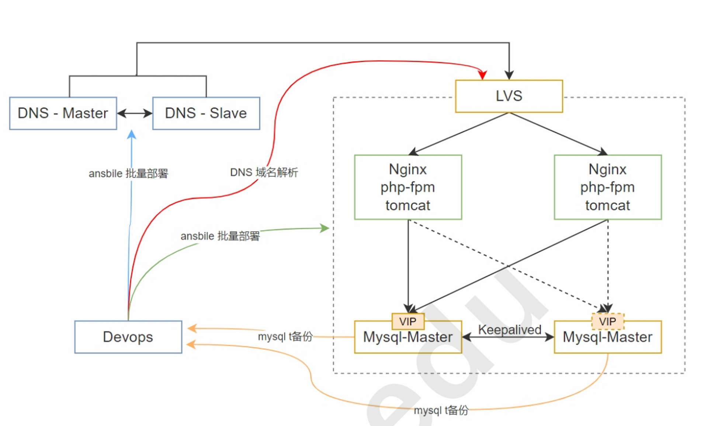

# 网络配置，前期与收尾工作

## devops

### 网络配置

```powershell
eth0: NAT   10.0.0.12
eth1: 仅主机 192.168.74.12
```

### 前期准备

下载软件包

```shell
wget https://gitee.com/Discuz/DiscuzX/attach_files/1773967/download -O /tmp/discuz.zip
wget https://github.com/JPressProjects/jpress/archive/refs/tags/v5.1.1.tar.gz -O /tmp/jpress.tar.gz
```

MySQL备份脚本

```shell
vim /tmp/mysql_backup.sh
chmod +x /tmp/mysql_backup.sh

#!/bin/bash

REMOTE_HOST="192.168.74.12"
REMOTE_DIR="/data/"

IP_ADDRESS=$(ip addr show eth1 | grep 'inet ' | awk '{print $2}' | cut -d/ -f1| head -n1)

# 当前日期
DATE=$(date +\%Y_\%m_\%d)

# MySQL 用户和密码
MYSQL_USER="root"
MYSQL_PASSWORD="123456"

# 数据库名
DB1="jpress"
DB2="discuz"

# 备份文件保存路径
BACKUP_DIR="/tmp"

# 备份文件名
BACKUP_FILE1="${BACKUP_DIR}/${DATE}_jpress.sql.gz"
BACKUP_FILE2="${BACKUP_DIR}/${DATE}_discuz.sql.gz"

# 执行 mysqldump 备份
mysqldump -u$MYSQL_USER -p$MYSQL_PASSWORD $DB1 -F -E -R --triggers --single-transaction --source-data=2 --flush-privileges --default-character-set=utf8 --hex-blob | gzip > $BACKUP_FILE1          
mysqldump -u$MYSQL_USER -p$MYSQL_PASSWORD $DB2 -F -E -R --triggers --single-transaction --source-data=2 --flush-privileges --default-character-set=utf8 --hex-blob | gzip > $BACKUP_FILE2

# 检查目标目录是否存在，如果不存在，则创建它
ssh -o StrictHostKeyChecking=no root@$REMOTE_HOST "mkdir -p $REMOTE_DIR/$IP_ADDRESS"

# 远程传输备份文件到 devops 服务器
scp $BACKUP_FILE1 root@$REMOTE_HOST:$REMOTE_DIR/$IP_ADDRESS
scp $BACKUP_FILE2 root@$REMOTE_HOST:$REMOTE_DIR/$IP_ADDRESS

# 删除本地备份文件
rm -f $BACKUP_FILE1 $BACKUP_FILE2
```

多主机免密登录脚本

```shell
#!/bin/bash

# 定义主机列表、用户名和密码
HOSTS=("10.0.0.220" "10.0.0.221" "10.0.0.222" "10.0.0.223" "10.0.0.224" "10.0.0.225" "10.0.0.226") # 将目标主机 IP 添加到这里
USER="root"                          # 修改为目标主机的用户名
PASSWORD="123456"                      # 修改为目标主机的密码

# 检查是否安装了 sshpass
if ! command -v sshpass &>/dev/null; then
    echo "==> 未找到 sshpass 工具，正在安装..."
    if [ -x "$(command -v apt)" ]; then
        sudo apt update && sudo apt install sshpass -y
    elif [ -x "$(command -v yum)" ]; then
        sudo yum install sshpass -y
    else
        echo "==> 无法自动安装 sshpass，请手动安装后重试。"
        exit 1
    fi
fi

# 1. 创建 SSH 密钥
if [ ! -f "$HOME/.ssh/id_rsa" ]; then
    echo "==> 生成 SSH 密钥对..."
    ssh-keygen -t rsa -b 2048 -f "$HOME/.ssh/id_rsa" -N ""
else
    echo "==> SSH 密钥对已存在，跳过生成步骤。"
fi


# 2. 将公钥添加到自身的 authorized_keys（连接自身）
echo "==> 添加公钥到自身的 authorized_keys..."
cat "$HOME/.ssh/id_rsa.pub" >> "$HOME/.ssh/authorized_keys"
chmod 600 "$HOME/.ssh/authorized_keys"

# 3. 分发密钥到其他主机
echo "==> 分发公钥到目标主机..."
for HOST in "${HOSTS[@]}"; do
    echo "----> 处理主机 $HOST ..."
    sshpass -p "$PASSWORD" scp -o StrictHostKeyChecking=no -r ~/.ssh "$USER@$HOST:" 2>/dev/null
    if [ $? -eq 0 ]; then
        echo "----> 主机 $HOST 已配置免密登录。"
    else
        echo "----> 无法配置主机 $HOST，请检查连接性和权限。"
    fi
done

# 验证是否成功
echo "==> 测试免密登录是否成功..."
for HOST in "${HOSTS[@]}"; do
    ssh -o BatchMode=yes "$USER@$HOST" "echo '$HOST 无密码登录成功'" 2>/dev/null
    if [ $? -eq 0 ]; then
        echo "----> 主机 $HOST 免密登录测试成功。"
    else
        echo "----> 主机 $HOST 免密登录测试失败，请检查。"
    fi
done

echo "==> 多主机免密认证配置完成！"
```

## DNS

### 网络配置

```powershell
dns—master
eth0: NAT   10.0.0.220

dns-slave
eth0: NAT   10.0.0.221
```

## LVS

### 网络配置

NAT 模式

DR模式下，又要作为网关，会发生冲突，响应包回不到客户端

```powershell
eth0: NAT   10.0.0.222 # 最后关闭
      VIP   10.0.0.100 php.m61-magedu.com
      VIP   10.0.0.101 java.m61-magedu.com
      
eth1: 仅主机 192.168.74.222
```

## nginx_php_tomcat

### 网络配置

```powershell
keepalived:
nginx_php_VIP: eth1 192.168.74.101
nginx_php_VIP: eth1 192.168.74.102

web_node1
lo:   VIP  
eth0: NAT   10.0.0.223 # 最后关闭
eth1: 仅主机 192.168.74.223 gw: 192.168.74.222 # 脚本运行完加上gw,防止路由冲突，上不了网

web_node2
lo:   VIP
eth0: NAT   10.0.0.224 # 最后关闭
eth1: 仅主机 192.168.74.224 gw: 192.168.74.222 # 脚本运行完加上gw,防止路由冲突，上不了网
```

### 收尾

```shell
# ansible运行完，调整网络
ip link set down dev eth0
ip route add default via 192.168.74.222
```

## MySQL

### 网络配置

```powershell
VIP: eth1 192.167.74.100 

mysql_node1 BACKUP
eth0: NAT   10.0.0.225 # 最后关闭 ip link set down dev eth0
eth1: 仅主机 192.168.74.225

mysql_node2 MASTER
eth0: NAT   10.0.0.226 # 最后关闭 ip link set down dev eth0
eth1: 仅主机 192.168.74.226
```

### 收尾

```shell
# ansible运行完，调整网络
ip link set down dev eth0
```

可改进点：分开读写

discuz，node1写

jpress，node2写

# Ansible-playbook

## 结构

```shell
ansible-playbook/
├── ansible.cfg
├── hosts
├── play.yml
└── roles
    ├── dns
    │   ├── tasks
    │   │   ├── main.yml
    │   │   ├── master_dns.yml
    │   │   └── slave_dns.yml
    │   └── templates
    │   │   └── db.m61-magedu.com.j2
    ├── lvs
    │   └── tasks
    │       └── main.yml
    ├── mysql
    │   ├── tasks
    │   │   ├── main.yml
    │   │   ├── master_master.yml
    │   │   ├── mysql_cron_backup.yml
    │   │   ├── mysql_keepalived.yml
    │   │   └── server_db.yml
    │   └── templates
    │       └── keepalived.conf.j2
    └── nginx_php_tomcat
        ├── tasks
        │   ├── java.yml
        │   ├── lvs_RS.yml
        │   ├── main.yml
        │   ├── nginx.yml
        │   ├── php.yml
        │   └── tomcat.yml
        └── templates
            ├── java.m61-magedu.com.j2
            └── php.m61-magedu.com.j2

```

## ansible.cfg and hosts

### ansible.cfg

```ini
inventory=./hosts
interpreter_python=python3
# 其它为默认
```

### hosts

```ini
10.0.0.12 ansible_connection=local

[dns]
dns_master ansible_host=10.0.0.220
dns_slave  ansible_host=10.0.0.221

[LVS]
lvs        ansible_host=192.168.74.222 php-VIP=10.0.0.100 java-VIP=10.0.0.101

[nginx_php_tomcat]
web_node1   ansible_host=192.168.74.223
web_node2   ansible_host=192.168.74.224

[mysql]
mysql_node1 ansible_host=192.168.74.225
mysql_node2 ansible_host=192.168.74.226      
```

## play.yml 总剧本

```yml
---
# This playbook deploys the whole application stack in this site.

# 防止apt锁
#- name: apt update
#  hosts: all
#  remote_user: root
#
#  tasks:
#    - name: apt update
#      apt:
#        update_cache: yes
#      retries: 5
#      delay: 120

- name: Setup Master and Slave DNS
  hosts: dns
  remote_user: root
  vars:
    dns_master_IP: "{{ hostvars['dns_master']['ansible_host'] }}"
    dns_slave_IP:  "{{ hostvars['dns_slave']['ansible_host'] }}"
    java_web_IP:   "{{ hostvars['lvs']['java-VIP'] }}"
    php_web_IP:    "{{ hostvars['lvs']['php-VIP'] }}"

  roles:
    - dns

- name: Setup nginx_php_tomcat and RS
  hosts: nginx_php_tomcat 
  remote_user: root
  vars:
    php_version: "8.1"
    java_version: "8"
    tomcat_version: "9"
    nginx_php_VIP:  "192.168.74.101"
    nginx_java_VIP: "192.168.74.102"
  
  roles:
    - nginx_php_tomcat

- name: Setup MySQL
  hosts: mysql
  remote_user: root
  
  roles:
    - mysql

- name: Setup LVS
  hosts: LVS
  remote_user: root
  vars:
    php_web_IP:     "{{ hostvars['lvs']['php-VIP'] }}"
    java_web_IP:    "{{ hostvars['lvs']['java-VIP'] }}"
    nginx_php_VIP:  "192.168.74.101" 
    nginx_java_VIP: "192.168.74.102"

  roles:
    - lvs
```

## DNS-playbook

### main.yml

```yml
---
# tasks file for dns_role

- include_tasks: master_dns.yml
  when: inventory_hostname == "dns_master"

- include_tasks: slave_dns.yml
  when: inventory_hostname == "dns_slave"
```

### master_dns.yml

```yml
- name: Install bind9
  apt:
    name: "bind9"
    state: present

- name: Create dns rule
  template:
    src: db.m61-magedu.com.j2
    dest: /etc/bind/db.m61-magedu.com

- name: Add named conf
  blockinfile:
    path: /etc/bind/named.conf.default-zones
    marker: "// {mark} ANSIBLE MANAGED BLOCK"
    block: |
      zone "m61-magedu.com" {
          type master;
          file "/etc/bind/db.m61-magedu.com";
          allow-transfer { {{ hostvars['dns_slave']['ansible_host'] }}; };
      };

- name: Check zone
  shell: named-checkzone m61-magedu.com /etc/bind/db.m61-magedu.com

- name: rndc reload
  shell: rndc reload
```

### db.m61-magedu.com.j2

```jinja2
$TTL 1D
@          IN         SOA          dns          loong.noob.com.      ( {{ ansible_date_time.epoch }} 2D 1D 2W 3W )

@          IN         NS           dns
@          IN         NS           dns-slave

dns        IN         A            {{ dns_master_IP }}
dns-slave  IN         A            {{ dns_slave_IP }}
java       IN         A            {{ java_web_IP }}
php        IN         A            {{ php_web_IP }}
```

### slave_dns.yml

```yml
- name: Install bind9                                                                                                                                                                              
  apt:
    name: "bind9"
    state: present

- name: Add named conf
  blockinfile:
    path: /etc/bind/named.conf.default-zones
    marker: "// {mark} ANSIBLE MANAGED BLOCK"
    block: |
      zone "m61-magedu.com" {
          type slave;
          file "/var/cache/bind/db.m61-magedu.com";
          masters { {{ hostvars['dns_master']['ansible_host'] }}; };
      };

- name: rndc reload
  shell: rndc reload
```

## nginx_php_tomcat-playbook

### main.yml

```yml
---
# tasks file for nginx_php_tomcat

- include_tasks: php.yml

- include_tasks: java.yml

- include_tasks: nginx.yml

- include_tasks: tomcat.yml

- include_tasks: lvs_RS.yml

- include_tasks: nginx_keepalived.yml
```

### php.yml

```yml
- name: Install php
  apt:
    name: 
      - php{{ php_version }}-fpm
      - php{{ php_version }}-mysqli
      - php{{ php_version }}-xml
      - php{{ php_version }}
    state: present   

- name: Bind port
  lineinfile:
    path: /etc/php/{{ php_version }}/fpm/pool.d/www.conf
    regexp: '^listen ='
    line: 'listen = 127.0.0.1:9000'

- name: restart and enable php-fpm
  service:
    name: php{{ php_version }}-fpm
    state: restarted
    enabled: true
```

### java.yml

```yml
- name: Install java
  apt:
    name: openjdk-{{ java_version }}-jdk
    state: present
  retries: 5
  delay: 10
```

### nginx.yml

```yml
- name: Install nginx
  apt:
    name: nginx
    state: present

- name: Del default
  file:
    path: /etc/nginx/sites-enabled/default
    state: absent

- name: Add php conf
  template:
    src: php.m61-magedu.com.j2
    dest: /etc/nginx/conf.d/php.m61-magedu.com.conf

- name: Add java conf
  template:
    src: java.m61-magedu.com.j2
    dest: /etc/nginx/conf.d/java.m61-magedu.com.conf

- name: Discuz
  block:
    - name: Copy discuz to remote
      copy:
        src:  /tmp/discuz.zip
        dest: /tmp/discuz.zip
  rescue:
    - name: Download discuz
      get_url:
        url: "https://gitee.com/Discuz/DiscuzX/attach_files/1773967/download"
        dest: "/tmp/discuz.zip"

- name: Create dir discuz
  file:
    path: /var/www/html/discuz
    state: directory

- name: Ensure unzip is installed
  apt:
    name: unzip
    state: present

- name: unzip
  unarchive:
    src: /tmp/discuz.zip
    dest: /var/www/html/discuz
    owner: www-data
    group: www-data
    remote_src: yes

- name: restart and enable nginx
  service:
    name: nginx
    state: restarted
    enabled: true
```

### php.m61-magedu.com.j2

```jinja2
server {
  listen 80 default_server;
  server_name php.m61-magedu.com;

  root /var/www/html/discuz/upload;

  location / {       
    index index.php;
  }

  location ~ \.php$ {
    fastcgi_pass   127.0.0.1:9000;
    fastcgi_index  index.php;
    fastcgi_param  SCRIPT_FILENAME  $document_root$fastcgi_script_name;
    include        fastcgi_params;
  }
}
```

### java.m61-magedu.com.j2

```jinja2
server {
  listen 80;
  server_name java.m61-magedu.com;

  location / {
    proxy_pass http://127.0.0.1:8080;
  }
}
```

### tomcat.yml

```yml
- name: Install tomcat                                                                                                
  apt:
    name: tomcat{{ tomcat_version }}
    state: present

- name: Jpress
  block:
    - name: Copy jpress to remote
      copy:
        src:  /tmp/jpress.tar.gz
        dest: /tmp/jpress.tar.gz
  rescue:
    - name: Download discuz
      get_url:
        url: "https://github.com/JPressProjects/jpress/archive/refs/tags/v5.1.1.tar.gz"
        dest: "/tmp/jpress.tar.gz"

- name: unarchive
  unarchive:
    src: /tmp/jpress.tar.gz
    dest: /tmp
    remote_src: yes

- name: Remove default ROOT
  file:
    path: /var/lib/tomcat{{ tomcat_version }}/webapps/ROOT
    state: absent

- name: Copy jpress war
  copy:
    src: /tmp/jpress/starter-tomcat/target/starter-tomcat-5.0.war
    dest: /var/lib/tomcat{{ tomcat_version }}/webapps/ROOT.war
    remote_src: yes

- name: Copy jpress class
  ansible.builtin.copy:
    src: /tmp/jpress/starter-tomcat/target/classes/
    dest: /etc/tomcat{{ tomcat_version }}/
    remote_src: yes

- name: Change tomcat addree to 127.0.0.1
  lineinfile:
    path: /etc/tomcat{{ tomcat_version }}/server.xml
    insertafter: '<Connector port="8080" protocol="HTTP/1.1"'
    line: '               address="127.0.0.1"'

- name: restart and enable tomcat
  service:
    name: tomcat{{ tomcat_version }}
    state: restarted
    enabled: true
```

### lvs_RS.yml

```yml
- name: Add VIP to lo
  shell: ip a a 10.0.0.100/32 dev lo label lo:1
  ignore_errors: yes

- name: Add VIP to lo
  shell: ip a a 10.0.0.101/32 dev lo label lo:2                                                                                                                                                    
  ignore_errors: yes

- name: RS调整内核参数
  blockinfile:
    path: /etc/sysctl.conf
    block: |
      net.ipv4.conf.all.arp_ignore=1
      net.ipv4.conf.all.arp_announce=2
      net.ipv4.conf.lo.arp_ignore=1
      net.ipv4.conf.lo.arp_announce=2

- name: sysctl -p
  shell: sysctl -p
```

### nginx_keepalived.yml

```yml
- name: Install keepalived
  apt:
    name: keepalived
    state: present

- name: Create keepalived config
  template:
    src: keepalived.conf.j2
    dest: /etc/keepalived/keepalived.conf

- name: restart and enable keepalived
  service:
    name: keepalived
    state: restarted
    enabled: true
```

### keepalived.conf.j2

```jinja2
global_defs {
   router_id {{ hostvars[inventory_hostname]['ansible_host'] }}
   vrrp_skip_check_adv_addr
   vrrp_garp_interval 0
   vrrp_gna_interval 0
}

vrrp_script check_80 {
    script "systemctl is-active nginx"   
    interval 1
    weight -30
    fall 3
    rise 2
    timeout 2
}

vrrp_instance java {
    state BACKUP
    interface eth1
    virtual_router_id 88
    priority {{ ansible_facts['default_ipv4']['address'].split('.')[-1] | int % 30 + 70 }}
    advert_int 1
    nopreempt

    authentication {
        auth_type PASS
        auth_pass 123456
    }
    
    virtual_ipaddress {
        {{ nginx_java_VIP }}/24 dev eth1 label eth1:2
    }
    
    track_script {
        check_80   
    }

    unicast_src_ip {{ hostvars[inventory_hostname]['ansible_host'] }}
    unicast_peer {

        {{ ip }}

    
    }
}

vrrp_instance php {
    state BACKUP
    interface eth1
    virtual_router_id 77
    priority {{ 30 - ( ansible_facts['default_ipv4']['address'].split('.')[-1] | int % 30 ) + 70 }}
    advert_int 1
    nopreempt

    authentication {
        auth_type PASS
        auth_pass 123456
    }

    virtual_ipaddress {
        {{ nginx_php_VIP }}/24 dev eth1 label eth1:1
    }

    track_script {
        check_80
    }

    unicast_src_ip {{ hostvars[inventory_hostname]['ansible_host'] }}
    unicast_peer {

        {{ ip }}


    }
}
```


## mysql-playbook

### main.yml

```yml
---
# tasks file for mysql_role

- name: Install MySQL server
  apt:
    name: mysql-server
    state: present 

- name: Change bind address
  lineinfile:
    path: /etc/mysql/mysql.conf.d/mysqld.cnf
    regexp: '^bind-address'
    line: 'bind-address        = 0.0.0.0'

- name: Install python for MySQL
  apt:
    name:
      - python3
      - python3-pip
      - python3-dev
      - default-libmysqlclient-dev
      - build-essential
      - pkg-config
    state: present
  retries: 3
  delay: 10

- name: pip mysqlclient
  pip:
    name: mysqlclient
    executable: pip3
  retries: 3
  delay: 10

- include_tasks: server_db.yml  

- include_tasks: master_master.yml

- include_tasks: mysql_keepalived.yml

- include_tasks: mysql_cron_backup.yml
```

### server_db.yml

```yml
- name: Create discuzer user
  mysql_user:
    name: discuzer
    host: '192.168.74.%'
    password: 123456
    state: present
    login_user: root
    login_password: 123456

- name: Create jpresser user
  mysql_user:
    name: jpresser
    host: '192.168.74.%'
    password: 123456
    state: present
    login_user: root
    login_password: 123456

- name: Create discuz 
  mysql_db:
    name: discuz                                                                                                                                                
    state: present                                                                                                                                                                                 
    login_user: root
    login_password: 123456

- name: Create jpress database
  mysql_db:
    name: jpress                                                                                                                                                                                 
    state: present
    login_user: root
    login_password: 123456     

- name: Discuzer priv
  mysql_user:
    name: discuzer
    host: '192.168.74.%'
    priv: 'discuz.*:ALL'
    state: present
    login_user: root
    login_password: 123456

- name: Jpresser priv
  mysql_user:
    name: jpresser
    host: '192.168.74.%'
    priv: 'jpress.*:ALL'
    state: present
    login_user: root
    login_password: 123456
```

### master_master.yml

```yml
- name: Create repluser user
  mysql_user:
    name: repluser
    host: '192.168.74.%'
    password: 123456
    state: present
    login_user: root
    login_password: 123456

- name: Repluser priv
  mysql_user:
    name: repluser
    host: '192.168.74.%'
    priv: '*.*:REPLICATION SLAVE'
    state: present
    login_user: root
    login_password: 123456

- name: FLUSH PRIVILEGES
  mysql_query:
    query: "FLUSH PRIVILEGES;"
    login_user: root
    login_password: 123456

- name: Add MySQL conf
  blockinfile:
    path: /etc/mysql/mysql.conf.d/mysqld.cnf
    marker: "# {mark} ANSIBLE MANAGED BLOCK"
    block: |
      server-id={{ ansible_facts['default_ipv4']['address'].split('.')[-1] }}
      log_bin=/var/log/mysql/mysql-bin.log
      default_authentication_plugin=mysql_native_password
      gtid_mode=ON
      enforce_gtid_consistency=ON

- name: restart and enable mysql
  service:
    name: mysql
    state: restarted
    enabled: true

- name: Stop slave
  mysql_query:
    query: "stop slave;"
    login_user: root
    login_password: 123456

- name: Slave conf
  mysql_query:
    query: >
      CHANGE MASTER TO 
      MASTER_HOST='{{ groups['mysql'] | difference([inventory_hostname]) | map('extract', hostvars, 'ansible_host') | list | first}}', 
      MASTER_USER='repluser', 
      MASTER_PASSWORD='123456', 
      MASTER_PORT=3306, 
      MASTER_AUTO_POSITION=1;
    login_user: root
    login_password: 123456

- name: Start slave
  mysql_query:
    query: "start slave;"
    login_user: root
    login_password: 123456
```

### mysql_keepalived.yml

```yml
- name: Install keepalived
  apt:
    name: keepalived
    state: present

- name: Create keepalived config
  template:
    src: keepalived.conf.j2
    dest: /etc/keepalived/keepalived.conf

- name: restart and enable keepalived
  service:
    name: keepalived
    state: restarted
    enabled: true
```

### keepalived.conf.j2

```jinja2
global_defs {
   router_id {{ hostvars[inventory_hostname]['ansible_host'] }}
   vrrp_skip_check_adv_addr
   vrrp_garp_interval 0
   vrrp_gna_interval 0
}

vrrp_script check_80 {
    script "</dev/tcp/127.0.0.1/80"   
    interval 1
    weight -30
    fall 3
    rise 2
    timeout 2
}

vrrp_instance java {

    state MASTER

    state BACKUP

    interface eth1
    virtual_router_id 88
    priority {{ ansible_facts['default_ipv4']['address'].split('.')[-1] | int % 30 + 70 }}
    advert_int 1

    authentication {
        auth_type PASS
        auth_pass 123456
    }
    
    virtual_ipaddress {
        {{ nginx_java_VIP }}/24 dev eth1 label eth1:2
    }
    
    track_script {
        check_80   
    }

    unicast_src_ip {{ hostvars[inventory_hostname]['ansible_host'] }}
    unicast_peer {

        {{ ip }}

    
    }
}

vrrp_instance php {

    state MASTER

    state BACKUP

    interface eth1
    virtual_router_id 77
    priority {{ 30 - ( ansible_facts['default_ipv4']['address'].split('.')[-1] | int % 30 ) + 70 }}
    advert_int 1

    authentication {
        auth_type PASS
        auth_pass 123456
    }

    virtual_ipaddress {
        {{ nginx_php_VIP }}/24 dev eth1 label eth1:1
    }

    track_script {
        check_80
    }

    unicast_src_ip {{ hostvars[inventory_hostname]['ansible_host'] }}
    unicast_peer {

        {{ ip }}


    }
}
```

### mysql_cron_backup.yml

```yml
- name: Add cron task to backup mysql data to devops
  lineinfile:
    path: /etc/crontab
    line: 5  *    * * *   root    /mysql_backup.sh

- name: Copy backup_mysql shell script to remote
  copy:
    src: /tmp/mysql_backup.sh
    dest: /
    mode: '0755'
```

## lvs-playbook

### main.yml

```yml
---
# tasks file for lvs

- name: install ipvsadm
  apt:
    name: ipvsadm
    state: present

- name: Add php-VIP to eth0
  shell: ip a a 10.0.0.100/32 dev eth0 label eth0:1                                                                                      
  ignore_errors: yes

- name: Add java-VIP to eth0
  shell: ip a a 10.0.0.101/32 dev eth0 label eth0:2                                                                              
  ignore_errors: yes

- name: Open ip forward
  blockinfile:
    path: /etc/sysctl.conf
    block: |
      net.ipv4.ip_forward=1

- name: sysctl -p
  shell: sysctl -p

- name: Add rules ipvsadm
  blockinfile:
    path: /etc/ipvsadm.rules
    block: |
      -A -t {{ php_web_IP }}:80 -s sh
      -a -t {{ php_web_IP }}:80 -r {{ nginx_php_VIP }}:80 -m
      -A -t {{ java_web_IP }}:80 -s sh
      -a -t {{ java_web_IP }}:80 -r {{ nginx_java_VIP }}:80 -m

- name: Clean rule
  shell: ipvsadm -C

- name: Load rule
  shell: ipvsadm-restore < /etc/ipvsadm.rules
```

# 开始

```shell
# 多主机免密登录
bash ssh_connection.sh

# mysql_backup.sh, jpress.tar.gz, discuz.zip放入tmp目录下

cd ansible-playbook
# 如果报错退出，可能是网络问题，重复运行play.yml
ansible-playbook play.yml
```

# 测试

## DNS测试

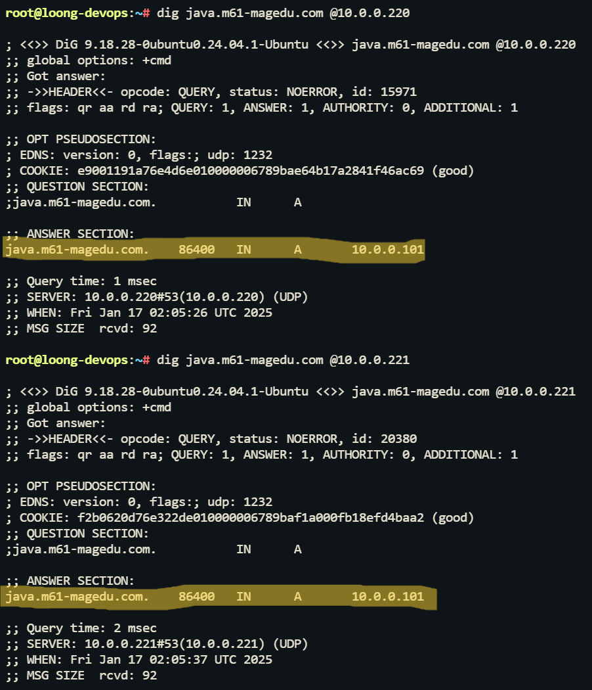

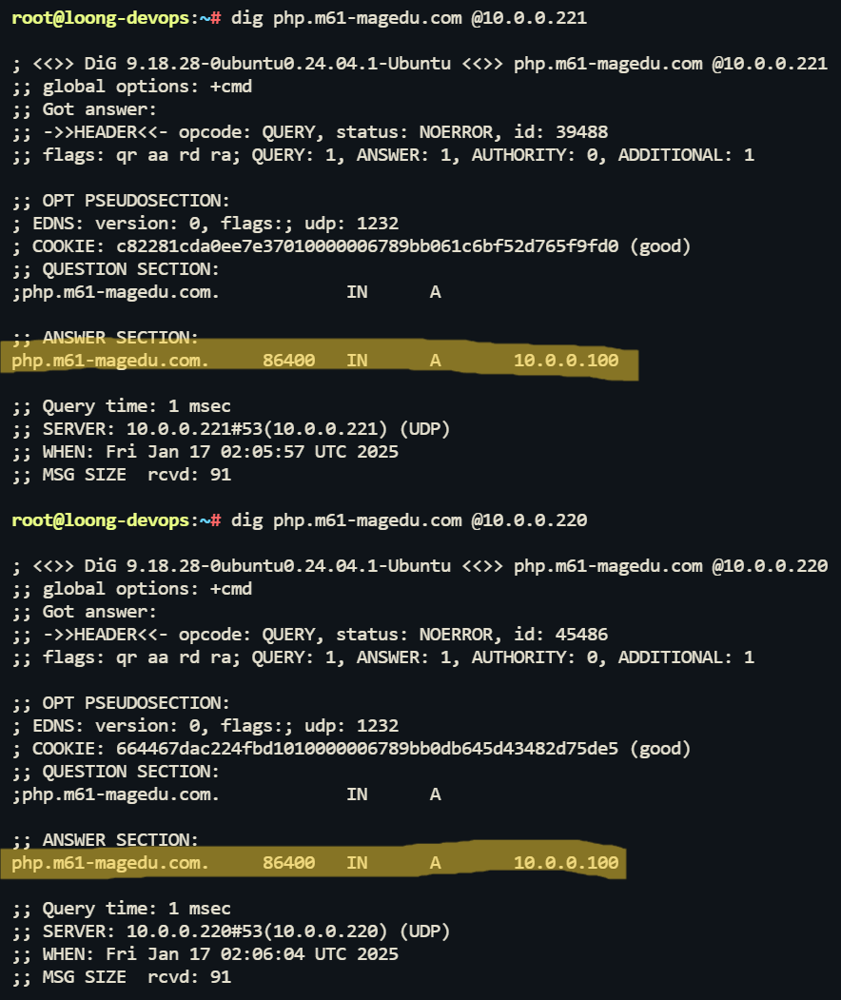

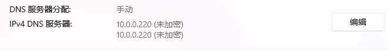

## 网站访问

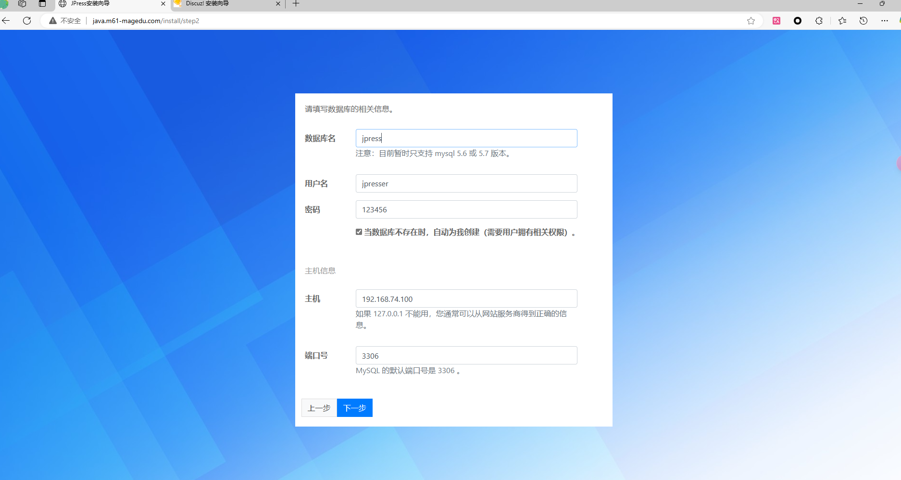


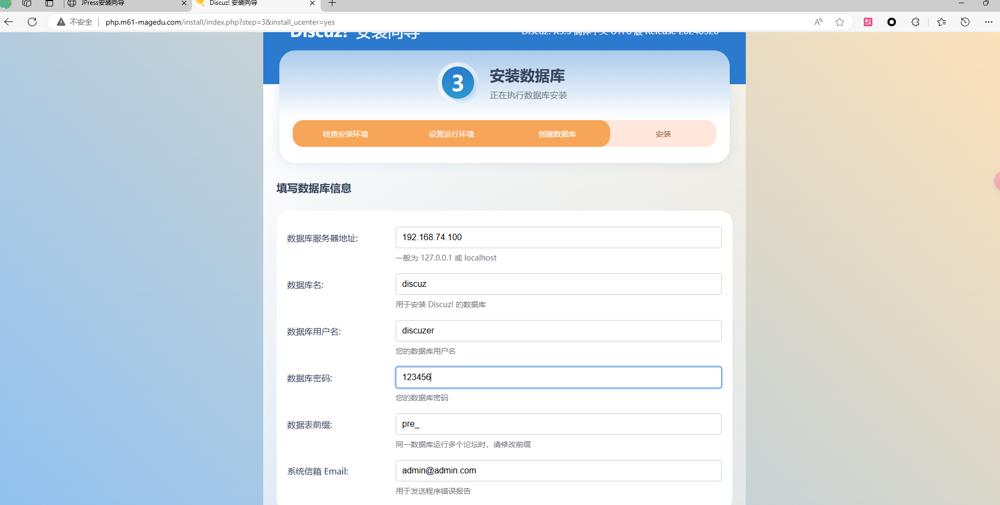

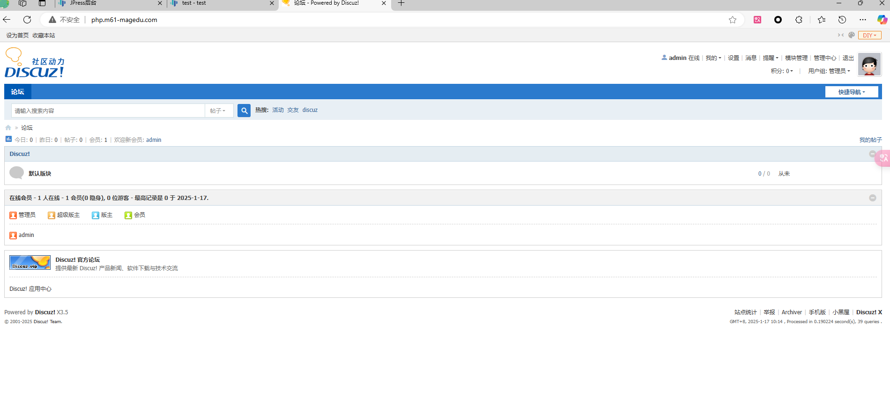

## MySQL

### 查看工作是否正常

数据同步

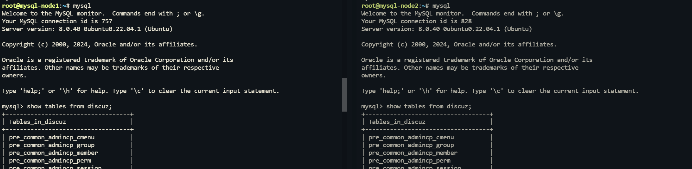

slave状态

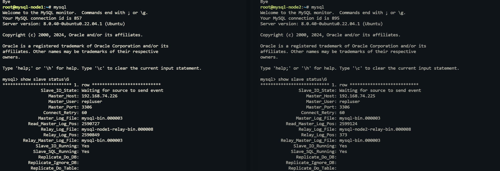

### keepalived高可用测试

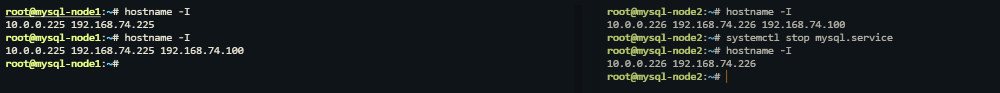

Jpress 网站访问测试(评论提交成功)


Discuz 网站访问测试(用户添加成功)

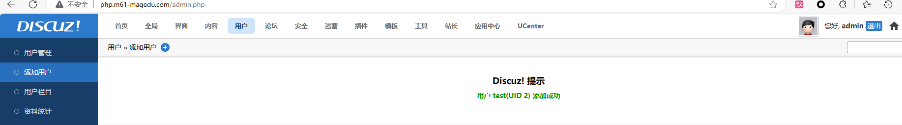

## nginx-keepalived高可用测试

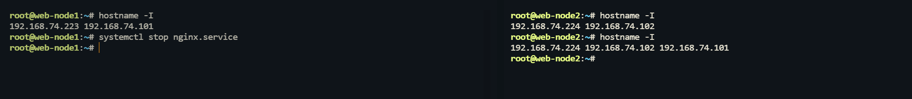

## mysqldump测试

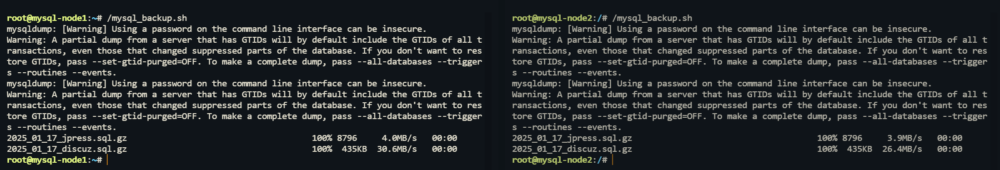

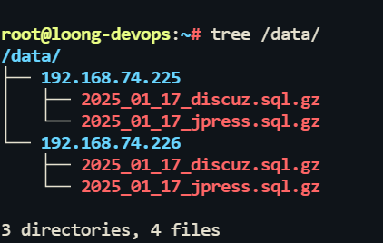
