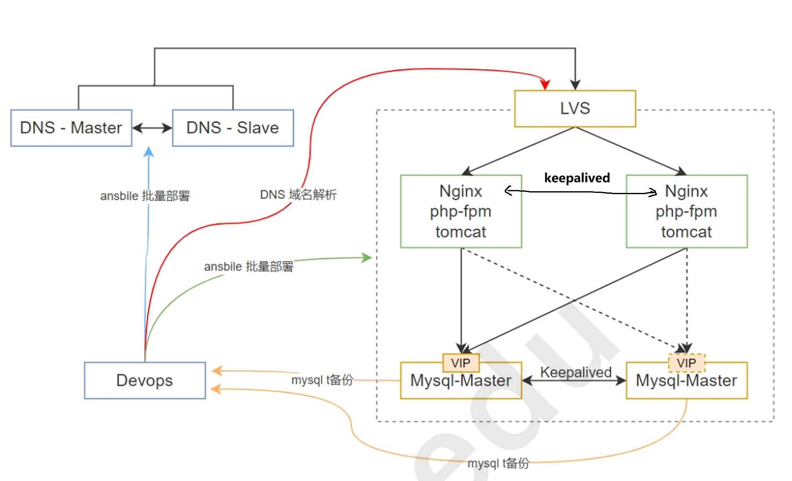

# devops

```powershell
eth0: NAT   10.0.0.12
eth1: 仅主机 192.168.74.12
```

下载软件包

```shell
wget https://gitee.com/Discuz/DiscuzX/attach_files/1773967/download -O /tmp/discuz.zip
wget https://github.com/JPressProjects/jpress/archive/refs/tags/v5.1.1.tar.gz -O /tmp/jpress.tar.gz
```

MySQL备份脚本

```shell
vim /tmp/mysql_backup.sh
chmod +x /tmp/mysql_backup.sh

#!/bin/bash

REMOTE_HOST="192.168.74.12"
REMOTE_DIR="/data/"

IP_ADDRESS=$(ip addr show eth1 | grep 'inet ' | awk '{print $2}' | cut -d/ -f1)

# 当前日期
DATE=$(date +\%Y_\%m_\%d)

# MySQL 用户和密码
MYSQL_USER="root"
MYSQL_PASSWORD="123456"

# 数据库名
DB1="jpress"
DB2="discuz"

# 备份文件保存路径
BACKUP_DIR="/tmp"

# 备份文件名
BACKUP_FILE1="${BACKUP_DIR}/${DATE}_jpress.sql.gz"
BACKUP_FILE2="${BACKUP_DIR}/${DATE}_discuz.sql.gz"

# 执行 mysqldump 备份
mysqldump -u$MYSQL_USER -p$MYSQL_PASSWORD $DB1 -F -E -R --triggers --single-transaction --source-data=2 --flush-privileges --default-character-set=utf8 --hex-blob | gzip > $BACKUP_FILE1          
mysqldump -u$MYSQL_USER -p$MYSQL_PASSWORD $DB2 -F -E -R --triggers --single-transaction --source-data=2 --flush-privileges --default-character-set=utf8 --hex-blob | gzip > $BACKUP_FILE2

# 检查目标目录是否存在，如果不存在，则创建它
ssh -o StrictHostKeyChecking=no root@$REMOTE_HOST "mkdir -p $REMOTE_DIR/$IP_ADDRESS"

# 远程传输备份文件到 devops 服务器
scp $BACKUP_FILE1 root@$REMOTE_HOST:$REMOTE_DIR/$IP_ADDRESS
scp $BACKUP_FILE2 root@$REMOTE_HOST:$REMOTE_DIR/$IP_ADDRESS

# 删除本地备份文件
rm -f $BACKUP_FILE1 $BACKUP_FILE2
```


# DNS

```powershell
dns—master
eth0: NAT   10.0.0.220

dns-slave
eth0: NAT   10.0.0.221
```

# LVS

NAT 模式

DR模式下，又要作为网关，会发生冲突，响应包回不到客户端

```powershell
eth0: NAT   10.0.0.222 # 最后关闭
      VIP   10.0.0.100 php.m61-magedu.com
      VIP   10.0.0.101 java.m61-magedu.com
      
eth1: 仅主机 192.168.74.222
```

# nginx_php_tomcat

```powershell
web_node1
lo:   VIP  
eth0: NAT   10.0.0.223 # 最后关闭
eth1: 仅主机 192.168.74.223 gw: 192.168.74.222 # 脚本运行完加上gw,防止路由冲突，上不了网

web_node2
lo:   VIP
eth0: NAT   10.0.0.224 # 最后关闭
eth1: 仅主机 192.168.74.224 gw: 192.168.74.222 # 脚本运行完加上gw,防止路由冲突，上不了网
```

```shell
# ansible运行完，调整网络
ip link set down dev eth0
ip route add default via 192.168.74.222
```


# MySQL

```powershell
VIP: 192.167.74.100 

mysql_node1 BACKUP
eth0: NAT   10.0.0.225 # 最后关闭 ip link set down dev eth0
eth1: 仅主机 192.168.74.225

mysql_node2 MASTER
eth0: NAT   10.0.0.226 # 最后关闭 ip link set down dev eth0
eth1: 仅主机 192.168.74.226
```

```shell
# ansible运行完，调整网络
ip link set down dev eth0
```

可改进点：

discuz，node1写

jpress，node2写
